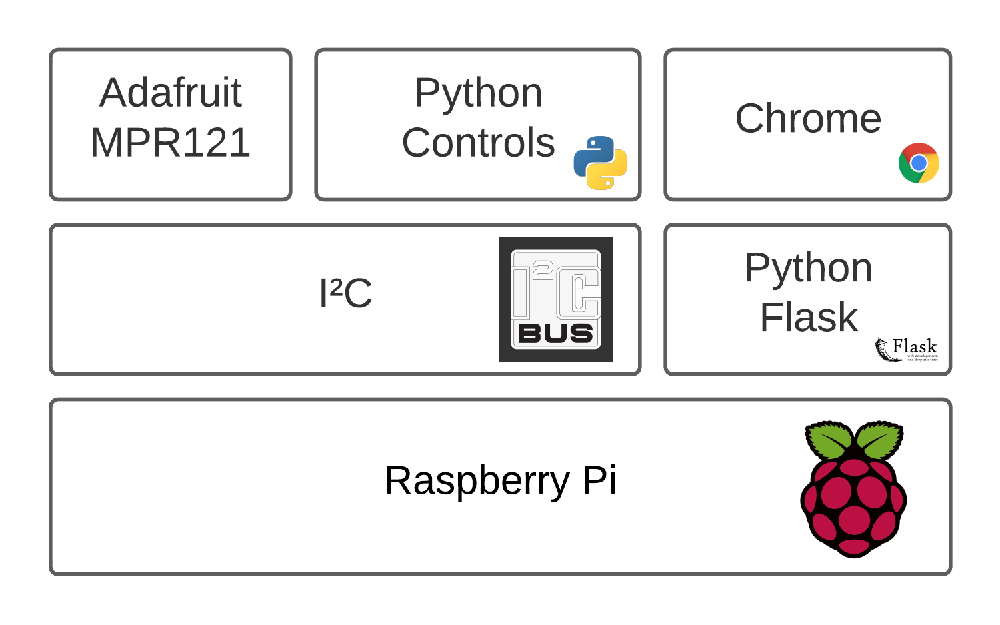

# Architecture
The software stack is built upon a Raspberry Pi. We're making use of the I²C bus for interfacing with capacitive touch traces. To do this we are making use of the `Adafruit MP121`. On the Pi there are 2 main programs running. The Python `Flask` application and the controls application. Chrome depends on the Flask application to work correctly, and the controls application relies on the I²C bus and the Adafruit MPR121 to function properly.

Below you can find a block diagram which shows how everything relies upon each other.

